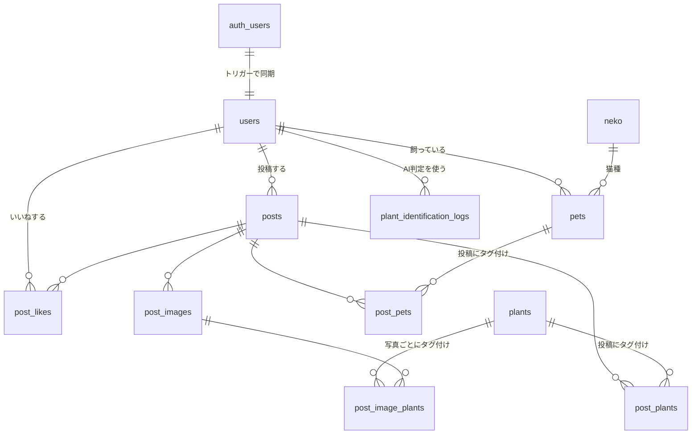

# データモデル

`public` スキーマは 11 テーブルで構成されます。スキーマの正は `supabase/migrations/*.sql` であり、
`prisma/schema.prisma` は `prisma db pull` で生成される Prisma Client 用の成果物です
（[../04-operations/database.md](../04-operations/database.md) を参照）。

## ER 図



## テーブル一覧

### ユーザーと猫

| テーブル | 役割 | 補足 |
| --- | --- | --- |
| `users` | ユーザープロフィール | `auth.users` とトリガーで同期。`auth_id` に一意制約 |
| `pets` | 飼い猫のプロフィール | 名前・猫種・写真・年齢・誕生日・性別 |
| `neko` | 猫種マスタ | `name` に一意制約。マイグレーションで投入（49種）。書き込みAPIを持たない運用マスタ |

`users.alias_id` は URL に使う短い識別子（`/[aliasId]`）。`users.role` は `'user'`（既定）または `'admin'`。`users.bio` は自己紹介（任意。上限 `MAX_USER_BIO_LENGTH` = 300文字はアプリ側で検証し、公開プロフィールに表示される）。

### 投稿

| テーブル | 役割 | 制約 |
| --- | --- | --- |
| `posts` | 投稿本体（コメント） | `created_at` 降順・`user_id` にインデックス |
| `post_images` | 投稿写真 | `order` で並び順を保持。1投稿あたり最大3枚 |
| `post_plants` | 投稿 × 植物のタグ付け | `(post_id, plant_id)` に一意制約。1投稿あたり最大5件 |
| `post_pets` | 投稿 × 猫のタグ付け | `(post_id, pet_id)` に一意制約。1投稿あたり最大10件 |
| `post_image_plants` | **写真ごと**の植物タグ付け | `(post_image_id, plant_id)` に一意制約 |
| `post_likes` | いいね | `(post_id, user_id)` に一意制約 |

`post_plants`（投稿単位）と `post_image_plants`（写真単位）が併存します。
共存実績の集計は **`post_plants` を使います**（後述）。

上限値は `src/lib/const.ts` に定義されています（`MAX_POST_IMAGES` = 3、`MAX_POST_PLANTS` = 5、
`MAX_POST_PETS` = 10、`MAX_POST_COMMENT_LENGTH` = 500）。

### 植物とAI

| テーブル | 役割 | 補足 |
| --- | --- | --- |
| `plants` | 植物カタログ | 分類学情報（`scientific_name` / `family` / `genus` / `species`）。正規化キーに一意インデックス（後述） |
| `plant_identification_logs` | AI判定の実行ログ | レート制限の判定に使う。`(user_id, created_at DESC)` にインデックス |

`plant_identification_logs` は **RLS ポリシーを1本も持ちません**（= PostgREST 経由では全拒否）。
Prisma 経由でのみアクセスします。

### 植物名の正規化と一意制約

`plants` は `addPlant` でログインユーザーが誰でも追加できる **UGCマスタ**です。
表記揺れの重複が入ると共存実績（後述）が分断され、投稿があるのに「情報がない」という
誤ったシグナルを出してしまうため、DB側で正規化キーに一意インデックスを張っています。

```sql
-- plants_name_normalized_key
lower(btrim(regexp_replace(normalize(name, NFKC), '\s+', ' ', 'g')))
```

これで `モンステラ` / `モンステラ ` / `Monstera` / `ｍｏｎｓｔｅｒａ` / `ﾊﾟｷﾗ` の重複が入りません。
`normalize(NFKC)` を**最初**に適用するのが要点で、全角スペース（U+3000）や半角カナは
NFKC で畳まれて初めて `\s` で拾えます（順序を逆にすると `　` が空白として扱われません）。

アプリ側の対応実装は3箇所で、**式を変えるなら必ず同時に変更**します。

| 場所 | 役割 |
| --- | --- |
| マイグレーション `20260809152920_*` | 一意インデックスの式（正） |
| `src/lib/plant-name.ts` | `normalizePlantName`（保存する表示名。大文字小文字は保持）と `plantNameKey`（重複判定キー。lower まで適用） |
| `src/lib/plant-name-query.ts` | `findPlantByNameKey` / `findPlantsByNameKeys`。式インデックスを使わせるため Raw SQL |

実装上の注意:

- **Prisma は式インデックスを表現できません。** `prisma db pull` しても `schema.prisma` には
  doc コメントが付くだけで `@@unique` は生成されず、`upsert` / `connectOrCreate` も使えません。
  「`findPlantByNameKey` で事前チェック → `create` → P2002 を握って既存IDを返す」パターンを維持します
- `addPlant` / `updatePlant` は P2002（一意違反）を `ALREADY_EXISTS` + 既存IDに変換します。
  投稿フローは新規植物を逐次登録するため、二度押しや同時登録で競合が実際に起きます。
  ここで `INTERNAL_SERVER_ERROR` を返すと「植物は登録済みなのに投稿できない」失敗になります
- `searchPlantName` は `mode: "insensitive"` です。ここが大文字小文字を区別すると、
  ユーザーが `monstera` と入力しても既存の `Monstera` を見つけられず新規登録に進み、一意違反になります
- AI判定（`plant-identification-action.ts`）の既存植物との照合も正規化キーで行います。
  完全一致だけで引くと、AIが `monstera` と返したときに `Monstera` に当たらず重複登録に進みます

## 共存実績（Coexistence）の集計

サービスの中核指標です。「この植物は何匹の猫と一緒に暮らしているか」を表します。

### 定義

**`post_plants` と `post_pets` を `post_id` で結合した、ユニークな `pet_id` の数。**

```sql
SELECT ppl.plant_id,
       COUNT(DISTINCT ppl.post_id) AS post_count,
       COUNT(DISTINCT ppe.pet_id)  AS cat_count
FROM post_plants ppl
LEFT JOIN post_pets ppe ON ppe.post_id = ppl.post_id
GROUP BY ppl.plant_id
```

**投稿数ではなくユニーク猫数を使う理由**は、同一ユーザーが同じ猫で何度も投稿しても
実績が水増しされないようにするためです（[../01-product/service-description.md](../01-product/service-description.md) §5.2）。

実装は `src/actions/plant-action.ts` の `fetchCoexistenceMap()`。
共存実績での絞り込み・並び替えが必要なため、**ID の選択は Raw SQL、詳細の取得は Prisma** という2段構えになっています。

### 表示ランク

`src/lib/coexistence.ts` が閾値とメッセージを持ちます。

| ユニーク猫数 | ランク | 表示 |
| --- | --- | --- |
| 50以上 | `many` | 多くの猫と暮らしています（N匹） |
| 10〜49 | `some` | N匹の猫と暮らしています |
| 1〜9 | `few` | 少数の暮らしが報告されています（N匹） |
| 0 | `none` | 猫との共存情報がありません |

**「危険」とは断定しません。** 情報がない場合は「情報がない」と表現します（ポジティブリスト方式）。
この方針の背景は [../01-product/service-description.md](../01-product/service-description.md) §5 を参照してください。

## 削除の伝播

ほぼ全ての外部キーが `ON DELETE CASCADE` です。

- `auth.users` の削除 → `users` → `posts` / `pets` / `post_likes` / `plant_identification_logs` が連鎖削除
- `posts` の削除 → `post_images` / `post_plants` / `post_pets` / `post_likes` が連鎖削除
- `plants` の削除 → `post_plants` / `post_image_plants` が連鎖削除

例外は `pets.neko_id`（猫種マスタへの参照）で、`ON DELETE NO ACTION` です。

## 型の注意点

- `plant_identification_logs.id` は `BigInt`。Raw SQL の `COUNT()` も `bigint` で返るため、
  アプリ側で `Number()` 変換が必要です
- Prisma の `public_users` モデルは DB 上の `public.users`、`auth_users` は `auth.users` にマップされます
  （同名テーブルが2スキーマにあるため）
- `prisma.ts` では `auth_users` のパスワードハッシュ・各種トークンを**全クエリで既定除外**しています
  （`omit` 設定による多層防御）
